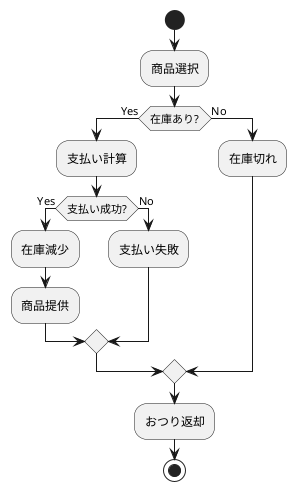
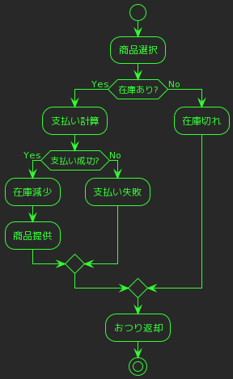
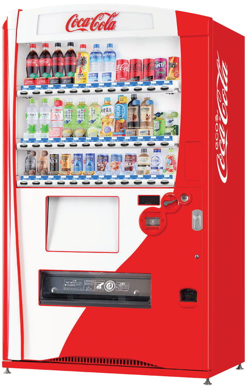
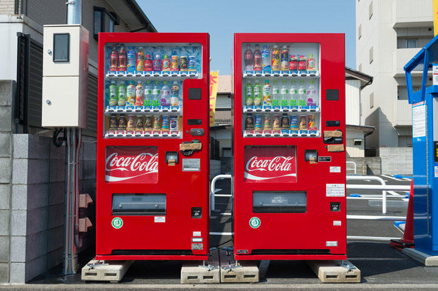
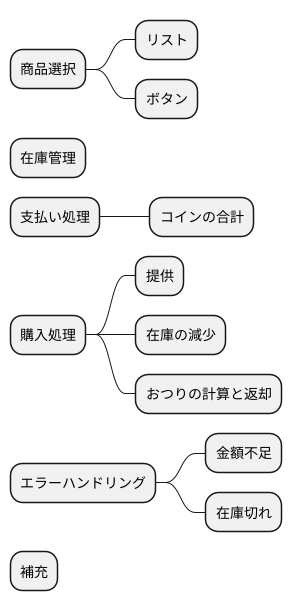

# memo.md
- [memo.md](#memomd)
  - [アクティビティ図](#アクティビティ図)
  - [画像](#画像)
  - [やりとり](#やりとり)
    - [自販機をシミュレートするコードを書きたい](#自販機をシミュレートするコードを書きたい)
    - [必要な画像素材](#必要な画像素材)
    - [何から手をつけるか](#何から手をつけるか)
    - [簡単な仕組みから](#簡単な仕組みから)
  - [設計](#設計)
    - [a](#a)

## アクティビティ図

## 画像

## やりとり
### 自販機をシミュレートするコードを書きたい

自動販売機の挙動をシミュレートするJavaScriptのプログラムを作成するのは面白いアイデアです。以下に、シンプルな自動販売機のシミュレーションのアウトラインを提案します：

1. 商品データの設定：自動販売機で販売する商品の情報をデータ構造で設定します。各商品には名前、価格、在庫などの情報が含まれます。

2. ユーザーインタフェースの設計：HTMLとCSSを使用して、ユーザーが商品を選択し、コインを挿入できるウェブページを作成します。商品ボタン、コインスロット、表示エリアなどを含めます。

3. 商品選択とコイン挿入の処理：JavaScriptを使用して、ユーザーが商品を選択し、コインを挿入した際の処理を実装します。選択した商品の価格を表示し、コインを受け入れて支払いを計算します。

4. 在庫管理：商品が選択されたとき、在庫が減少するようにします。在庫がない場合、選択した商品を購入できないようにします。

5. 支払いとおつり：ユーザーが支払いを行った後、おつりを計算し、必要に応じてコインを返却します。

6. エラーハンドリング：ユーザーが不適切なコインを挿入した場合や在庫切れの商品を選択した場合などのエラー処理を実装します。

7. ユーザーに結果を表示：ユーザーに購入結果やおつりの情報を表示し、必要に応じて商品の画像を更新します。

8. リセット機能：自動販売機をリセットして在庫を補充できるような機能を実装します。

このプロジェクトを進化させるために、さらに高度な機能を追加することも考えられます。たとえば、ユーザーアカウントや取引履歴の記録、異なるコインの受け入れ、多言語サポートなどが考えられます。このプロジェクトを通じて、JavaScriptのスキルを向上させ、楽しい自動販売機のシミュレーションを作成できるでしょう。

---
### 必要な画像素材

自動販売機のシミュレーションプログラムに画像を使用する場合、以下の種類の画像素材が役立つでしょう：

1. 商品画像: 各商品の外観を示す画像。これにより、ユーザーがどの商品を選んでいるかを視覚的に理解しやすくなります。商品名、価格などの情報も含めることができます。

2. コイン画像: シミュレーション内で使用するコインの画像。異なる額面や種類のコインを表現するために複数の画像が必要かもしれません。

3. 背景画像: シミュレーションのウェブページの背景に使用できる画像。自動販売機がどのような環境に配置されているかを表現するのに役立ちます。

4. アイコン: リセットボタン、支払いボタン、おつり表示など、ユーザーインタフェースのアイコンに使用できる画像。

これらの画像素材は、プロジェクトの外観を向上させ、ユーザーにわかりやすいインタラクションを提供するのに役立ちます。画像を用意する際に、商用利用可能な素材を選ぶか、必要に応じて自分でデザインすることが重要です。無料の素材ライブラリやデザインツールを活用することも一つの方法です。また、著作権に注意して、適切な画像を使用することも大切です。

---
### 何から手をつけるか

自動販売機のシミュレーションプログラムを作成する際、以下のステップで進めることが助けになります：

1. 商品データの設定:
   - シミュレーション内で扱う商品のデータを定義します。商品の名前、価格、在庫などの情報をオブジェクトまたは配列としてまとめます。

2. ユーザーインタフェースの設計:
   - HTMLとCSSを使用して、ユーザーが商品を選択し、コインを挿入できるウェブページを設計します。商品ボタン、コインスロット、表示エリアを作成します。

3. 商品選択とコイン挿入の処理:
   - JavaScriptを使用して、ユーザーが商品を選択し、コインを挿入したときの処理を実装します。選択した商品の価格を表示し、支払いを計算します。

4. 在庫管理:
   - 選択した商品が購入可能であるかどうか、在庫があるかどうかを確認し、在庫を減らす処理を追加します。

5. 支払いとおつり:
   - コインの挿入と支払いを処理し、必要に応じておつりを計算します。

6. エラーハンドリング:
   - 不適切なコインを挿入した場合や在庫切れの商品を選択した場合などのエラー処理を実装します。

7. ユーザーに結果を表示:
   - ユーザーに購入結果やおつりの情報を表示し、必要に応じて商品の画像を更新します。

8. リセット機能:
   - 自動販売機をリセットして在庫を補充できる機能を追加します。

これらのステップを順番に進めながら、プログラムの各機能を実装していくことが効果的です。また、コードの可読性を高めるために適切なコメントを追加し、テストケースを考えて動作確認を行うこともおすすめです。

---
### 簡単な仕組みから

理解しました。プロジェクトを段階的に進めることは非常に効果的です。以下は、自動販売機のプログラムを段階的に実装するための基本的なステップの一例です。最初は非常に基本的な機能から始めて、段階的に複雑な機能を追加していくことができます。

1. **商品選択の基本機能**:
    - 最初に、ユーザーが商品を選択できる単純なユーザーインターフェースを作成します。商品のリストを表示し、ユーザーがボタンをクリックして商品を選べるようにします。選択した商品の名前や価格を表示します。

2. **在庫の管理**:
    - 商品の在庫管理を導入します。各商品に在庫の情報を追加し、ユーザーが在庫切れの商品を選んだ場合にエラーメッセージを表示します。

3. **支払い処理**:
    - コイン挿入の基本的な機能を実装します。ユーザーがコインを挿入できるようにし、選択した商品の価格と挿入したコインの合計金額を表示します。

4. **購入処理**:
    - 商品が選択され、適切な支払いが行われた場合、商品の提供と在庫の減少を実装します。また、おつりの計算と返却を追加します。

5. **エラーハンドリング**:
    - 不適切なコインの挿入や在庫切れの商品の処理に対するエラーハンドリングを強化します。

6. **ユーザーインターフェースの改善**:
    - ユーザーエクスペリエンスを向上させるために、画像やアイコンを追加し、ユーザーに情報を視覚的に示すことを検討します。

7. **リセット機能**:
    - 自動販売機をリセットし、在庫を補充できる機能を実装します。

これらの段階を進むことで、段階的に自動販売機のプログラムを構築し、混乱せずに品質を保ちながら進めることができます。途中でコードをテストし、動作確認を行うことをおすすめします。

## 設計
1. 財布の中身はランダム
   1. 選択した飲み物の値段に応じて減算される
2. 画像は最初はスクリプトで
3. 値段はスクリプトで表示する
4. ボタンは売り切れ時に`diasble`にする
5. 緑枠には残りの数を表示し、売り切れたらメッセージを表示する
6. 補充ボタンを押すと補充される
7. ログには何が売れたかを表示する

### a
